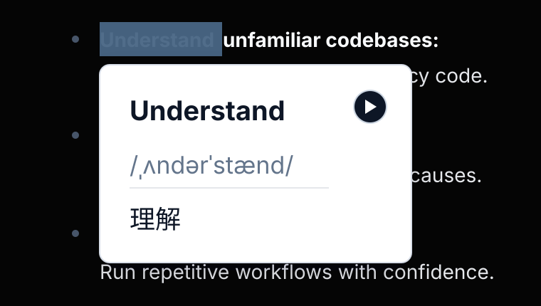
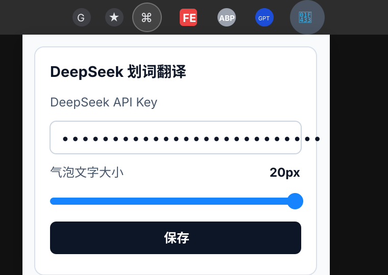

# DeepSeek 划词翻译

DeepSeek 划词翻译是一个 Chrome Extension。用户在网页中选中非中文文本后，插件会使用 DeepSeek Flash 翻译，并在选区附近显示一个紧凑、可播放原文的翻译气泡。

## 界面预览

### 划词翻译气泡



### 插件配置弹窗



## 功能特性

- 选中英文或其他非中文文本后自动显示翻译气泡。
- 选中中文文本时自动忽略，避免无意义调用。
- 气泡会优先显示在选区下方；下方空间不足时自动切换到上方。
- 气泡宽度会根据选中文字长度自适应，并限制在当前视口内。
- 气泡支持配置文字大小，原文、音标、译文会随字号同步调整。
- 选中后立即显示原文和加载占位，翻译完成后替换为音标与译文。
- 原文、音标、译文左对齐展示，播放按钮固定在右侧。
- 播放按钮使用 Chrome TTS，可在播放和停止状态之间切换。
- 播放结束后按钮会自动恢复为播放状态。
- DeepSeek 返回的音标会过滤非 IPA 内容，避免把中文拼音误展示为音标。
- DeepSeek API Key 通过点击插件图标打开的 popup 配置，不需要跳转到单独设置页。
- 翻译目标语言固定为中文，减少配置项。
- 本地缓存最多 100 条单词或短语翻译结果，超过后自动移除最早缓存。
- 插件使用透明背景鲸鱼图标，在 Chrome 工具栏中更清晰醒目。

## 使用方式

1. 点击浏览器工具栏中的插件图标。
2. 填写 DeepSeek API Key。
3. 按需要调整气泡文字大小，默认 12px。
4. 在网页中选中一段非中文文本。
5. 在弹出的气泡中查看原文、音标和中文翻译，也可以点击播放按钮朗读原文。

## 开发环境

项目需要 Node 20，版本约束记录在 `.nvmrc` 和 `.node-version` 中。

常用开发命令：

```bash
npm install
npm run check
npm test
npm run build
```

## 本地加载

1. 执行构建：

   ```bash
   npm run build
   ```

2. 打开 Chrome 的 `chrome://extensions`。
3. 开启右上角的 Developer mode。
4. 点击 Load unpacked。
5. 选择项目生成的 `dist` 目录。
6. 点击插件图标，填写 DeepSeek API Key，并按需要调整气泡文字大小。

## 数据说明

- DeepSeek API Key 保存在 Chrome local storage 中。
- 气泡文字大小保存在 Chrome local storage 中，默认 12px。
- 翻译缓存仅用于单词和短语，不用于长句或段落。
